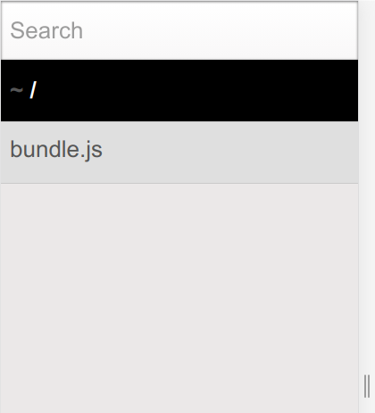

# React｜チュートリアル

## Environment

- OS: Ubuntu 18.04
- CLI:
    - nodejs: `10.15.3`
        - n (バージョン管理ツール): `4.1.0`
        - yarn (パッケージマネージャ): `1.16.0`
        - webpack (モジュールハンドラー): `4.35.0`
            - webpack-cli: `3.3.4`
            - webpack-dev-server: `3.7.2`
- Framework:
    - React: `3.0.1`

***

## Setup (0.25H)

### Install CLI Tools
```bash
# install nodejs
$ sudo apt install -y nodejs npm
$ sudo npm install -g n # Install n-install on global
$ sudo n stable # Install stable nodejs by using n-install
$ sudo apt purge -y nodejs npm # Remove old nodejs and npm
$ sudo apt autoremove -y

# install yarn on global
$ sudo bpm install -g yarn

# show versions
$ n --version
4.1.0

$ nodejs -v
10.15.3

$ yarn -v
1.16.0
```

***

## webpack導入 (0.25H)

### What's webpack?
- 複数のJavaScriptを1つにまとめることが可能
    - JS以外にも、CSSや画像もバンドル可能
- JavaScriptの元々の機能にはないモジュール機能を提供
    - 標準仕様(ECMAScript)の ES Modules が使用可能
    - node_modulesのモジュールを結合可能
- プラグインを使うことで、SassをコンパイルしたりAltJSをトランスコンパイルしたりすることも可能

---

### Install webpack
```bash
# install webpack, webpack-cli on local
$ yarn add -D webpack webpack-cli
```

---

### Configure webpack
`webpack.config.js`を作成し、以下のように設定する

```javascript
const path = require('path');

module.exports = {
    // 実行モード: develop => 開発, production => 本番
    // webpack4系以降はmodeを指定しないと警告が出る
    mode: 'development',
    // エントリーポイント
    entry: './src/index.js',
    // 出力設定
    output: {
        // バンドル後のファイル名
        filename: 'bundle.js',
        // 出力先のパス（※絶対パスで指定すること）
        path: path.join(__dirname, 'public')
    }
};
```

---

### Get started
動作確認のため、エントリーポイントに設定した`src/index.js`と、モジュール用の`src/mylib.js`を作成する

- **src/index.js**
    ```javascript
    // モジュール機能を使い mylib.js を読み込む
    import { hello } from "./mylib";

    // mylib.jsに定義されたJavaScriptを実行
    hello();
    ```
- **src/mylib.js**
    ```javascript
    // export文を使ってhello関数を定義
    export function hello() {
        alert("こんにちは！webpack");
    }
    ```

webpackでバンドルする

```bash
$ yarn webpack
# => src/index.js がトランスコンパイルされ public/bundle.js にバンドルされる
```

***

## webpack開発サーバー導入 (0.25H)

### Install webpack-dev-server
```bash
$ yarn add -D webpack-dev-server
```

---

### Configure webpack-dev-server
`webpack.config.js`に開発サーバーの設定を追加し、`package.json`にサーバー起動用のスクリプトを追加する

- **webpack.config.js**
    ```javascript
    module.exports = {
        // 〜省略〜
        // 開発サーバー設定
        devServer: {
            // 起点ディレクトリを public/ に設定
            contentBase: path.join(__dirname, 'public'),
            // ポートを3000に設定
            port: 3000,
            // ブラウザを自動的に開く
            open: true
        }
    };
    ```
- **package.json**
    ```json
    {
        // 〜省略〜
        "scripts": {
            // 開発サーバー起動スクリプト
            "start": "webpack-dev-server"
        }
    }
    ```

---

### Run webpack-dev-server
```bash
# execute `start` script
## => webpack-dev-server
$ yarn start

# => http://localhost:3000 で開発サーバー実行
```



***

## React導入 (0.75H)

### What's React?
React
: UIを効率よく構築するためのコポーネントベースJavaScriptライブラリ
JSXというシンタックスで記述されるため、BabelでES5にトランスコンパイルする必要がある

JSX
: DeNAによって開発されたウェブアプリケーション向けのプログラミング言語
JavaScriptのデメリットを解消することを目的に作られており、HTML風の構文を使うことも可能

コンポーネント
: UIを構築するための、小さく独立した部品
UIとは独立しているため、再利用しやすい
コンポーネントを組み合わせることで複雑なUIを作ることも可能

---

### Install React and Babel
```bash
# Reactとトランスコンパイル用のBabelをインストール
$ yarn add -D react react-dom
$ yarn add -D babel-loader @babel/core @babel/preset-env @babel/preset-react
```

---

### Configure React
`webpack.config.js`にReactトランスコンパイル用の設定を追加する

- **webpack.config.js**
    ```javascript
    module.exports = {
        // 〜省略〜
        // ビルドしたJavaScriptにsource-mapを書き出す
        devtool: 'inline-soruce-map',
        // モジュール設定
        module: {
            rules: [
                {
                    // .js, .jsx ファイルを babel-loader でトランスコンパイル
                    test: /\.js(x?)$/,
                    exclude: /node_modules/, // node_modules/ 内のファイルは除外
                    loader: 'babel-loader',
                    // Babel のオプションを指定
                    options: {
                        // preset_env, react の構文拡張を有効に
                        presets: [
                            ["@babel/preset-env"],
                            ["@babel/react"]
                        ]
                    }
                }
            ]
        }
    };
    ```

---

### コンポーネント作成
`React.Component`を継承して`ShoppingList`コンポーネントを作る

- **src/shopping-list.jsx**
    ```javascript
    import React from 'react';

    /**
     * ShoppingListコンポーネント
     * : React.Componentを継承して作成
     * 
     * Usage: <ShoppingList name="Mark" />
     */
    export default class ShoppingList extends React.Component {
        // renderメソッドでコンポーネント内部のHTMLタグを定義
        render() {
            return (
                <div className="shopping-list">
                <h1>Shopping List for {this.props.name}</h1>
                <ul>
                    <li>Instagram</li>
                    <li>WhatsApp</li>
                    <li>Oculus</li>
                </ul>
                </div>
            );
        }
    }
    ```

---

### Reactアプリケーション作成
上記で作成したShoppingListコンポーネントを使って、Webアプリケーションを作成する

- **public/index.html**
    - 開発サーバーのエントリーポイント
    ```html
    <!DOCTYPE html>
    <html lang="ja">
        <head>
            <meta charset="utf-8">
        </head>
        <body>
            <!-- Reactにより id="root" の要素が置き換えられる -->
            <div id="root"></div>
            <!-- React + webpack によりバンドルされた bundle.js を読み込む -->
            <script src="./bundle.js"></script>
        </body>
    </html>
    ```
- **src/index.jsx**
    - Reactアプリケーションのエントリーポイント
        - `public/bundle.js`にバンドルされる
    ```javascript
    import React from 'react';
    import ReactDOM from 'react-dom';
    // ShoppingListコンポーネントを読み込む
    import ShoppingList from './shopping-list.jsx';

    // ReactDOMにより id="root" の要素を <ShoppingList name="Mark" /> に置き換える
    ReactDOM.render(
        <ShoppingList name="Mark" />,
        document.getElementById('root')
    );
    ```

必要なファイルを作成したら `webpack.config.js`を編集し、エントリーポイントを`src/index.jsx`に変更する

- **webpack.config.js**
    ```javascript
    module.exports = {
        // エントリーポイントを src/index.jsx に変更
        entry: './src/index.jsx',
        // 〜省略〜
    }
    ```

開発サーバーを起動し http://localhost:3000 にアクセスする

```bash
$ yarn start
# => .js, .jsx ファイルがBabelによりトランスコンパイル
# => public/bundle.js にバンドルされる
# => http://localhost:3000 で public/index.html が読み込まれる
```


##### Error: ENOSPC: System limit for number of file watchers reached, ...
Unix系OSを使っていると、Reactプロジェクトの開発サーバー実行時に上記のエラーが出ることがある

これはファイル監視の上限を超えている場合に出るエラーらしい

以下のコマンドでファイル監視の上限を引き上げれば上手く行くはず

参考: https://stackoverflow.com/questions/50793920/enospc-error-in-create-react-app

```bash
# ファイル監視の上限を524288にする
$ echo fs.inotify.max_user_watches=524288 | sudo tee -a /etc/sysctl.conf

# /etc/sysctl.conf の設定を再読込
$ sudo sysctl -p
```

***

## webpackでcssバンドル (0.25H)

### Install loaders
```bash
# cssバンドル用に必要な style-loader, css-loader インストール
$ yarn add -D style-loader css-loader
```

---

### Configure webpack
`webpack.config.js`にcssバンドル用の設定を加える

- **webpack.config.js**
    ```javascript
    module.exports = {
        // 〜省略〜
        // モジュール設定
        module: {
            rules: [
                // 〜省略〜
                {
                    // .css ファイル: css-loader => style-loader の順に適用
                    // - css-loader: cssをJSにトランスコンパイル
                    // - style-loader: <link>タグにスタイル展開
                    test: /\.css$/,
                    use: [
                        "style-loader",
                        {
                            loader: "css-loader",
                            options: { url: false }
                        }
                    ]
                }
            ]
        }
    };
    ```

---

### Reactアプリケーションにcss適用
`src/style.css`を作成し、`src/index.jsx`から読み込んでみる

- **src/style.css**
    ```css
    :root {
        --blue: #007bff;
        --indigo: #6610f2;
        --purple: #6f42c1;
        --pink: #e83e8c;
        --red: #dc3545;
        --orange: #fd7e14;
        --yellow: #ffc107;
        --green: #28a745;
        --teal: #20c997;
        --cyan: #17a2b8;
        --white: #fff;
        --gray: #6c757d;
        --gray-dark: #343a40;
        --primary: #007bff;
        --secondary: #6c757d;
        --success: #28a745;
        --info: #17a2b8;
        --warning: #ffc107;
        --danger: #dc3545;
        --light: #f8f9fa;
        --dark: #343a40;
        --breakpoint-xs: 0;
        --breakpoint-sm: 576px;
        --breakpoint-md: 768px;
        --breakpoint-lg: 992px;
        --breakpoint-xl: 1200px;
        --font-family-sans-serif: -apple-system, "BlinkMacSystemFont", "Helvetica Neue", Helvetica, "Arial", "ヒラギノ角ゴ ProN W3", "Hiragino Kaku Gothic ProN", "メイリオ", Meiryo, sans-serif, "Apple Color Emoji", "Segoe UI Emoji", "Segoe UI Symbol", "Noto Color Emoji";
        --font-family-monospace: SFMono-Regular, Menlo, Monaco, Consolas, "Liberation Mono", "Courier New", monospace;
    }
    
    *,
    *::before,
    *::after {
        box-sizing: border-box;
    }
    
    html {
        font-family: sans-serif;
        line-height: 1.15;
        -webkit-text-size-adjust: 100%;
        -webkit-tap-highlight-color: rgba(0, 0, 0, 0);
    }

    article, aside, figcaption, figure, footer, header, hgroup, main, nav, section {
        display: block;
    }

    body {
        margin: 0 auto;
        width: 80%;
        font-family: -apple-system, "BlinkMacSystemFont", "Helvetica Neue", Helvetica, "Arial", "ヒラギノ角ゴ ProN W3", "Hiragino Kaku Gothic ProN", "メイリオ", Meiryo, sans-serif, "Apple Color Emoji", "Segoe UI Emoji", "Segoe UI Symbol", "Noto Color Emoji";
        font-size: 1rem;
        font-weight: 400;
        line-height: 1.5;
        color: #212529;
        text-align: left;
        background-color: #fff;
    }

    ul, ol {
        color: #1e366a;
        border-top: solid #1e366a 1px;
        border-bottom: solid #1e366a 1px;
        padding: 0.5em 1.5em;
    }
    
    ul li, ol li {
        line-height: 1.5;
        padding: 0.5em 0;
    }
    ```
- **src/index.jsx**
    ```javascript
    // style.cssを取り込む
    import './style.css';

    // 〜省略〜
    ```


***

## Tutorial (3H)

Show [Tutorial.md](./Tutorial.md)

***

## Redux導入

Show [Redux.md](./Redux.md)
