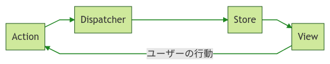

# Redux導入

## Introduction

### What's Redux?
Redux
: Fluxの思想を元に作られたJavaScriptアプリの状態管理フレームワーク

---

### Fluxの状態管理モデル
- データの状態は以下のフローに従い一方向に伝搬する
    ```
    Action => Dispatcher => Store => View
    ```
    
- ユーザーの行動によって`View`から`Action`を発行し、データの状態を伝搬させることも可能
    

---

### Install
```bash
$ yarn add -D react-redux
```

