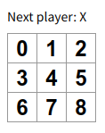
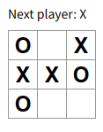
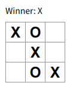
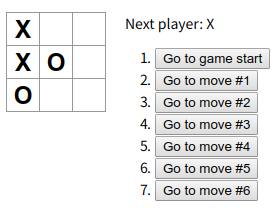

# React｜チュートリアル

## Tutorial (3H)

参考: https://ja.reactjs.org/tutorial/tutorial.html

**三目並べ**を作成する

### 準備

#### チュートリアル用のファイルの準備
チュートリアル用のスタイルシートやスクリプトを準備する

```bash
# srcディレクトリを clean up
$ rm -f src/*
```

- **src/index.css**
    ```css
    body {
        font: 14px "Century Gothic", Futura, sans-serif;
        margin: 20px;
    }

    ol, ul {
        padding-left: 30px;
    }

    .board-row:after {
        clear: both;
        content: "";
        display: table;
    }

    .status {
        margin-bottom: 10px;
    }

    .square {
        background: #fff;
        border: 1px solid #999;
        float: left;
        font-size: 24px;
        font-weight: bold;
        line-height: 34px;
        height: 34px;
        margin-right: -1px;
        margin-top: -1px;
        padding: 0;
        text-align: center;
        width: 34px;
    }

    .square:focus {
        outline: none;
    }

    .kbd-navigation .square:focus {
        background: #ddd;
    }

    .game {
        display: flex;
        flex-direction: row;
    }

    .game-info {
        margin-left: 20px;
    }
    ```
- **src/index.jsx**
    ```javascript
    import React from 'react';
    import ReactDOM from 'react-dom';
    import './index.css';

    /**
     * Squareコンポーネント｜クリック可能なマス
     * - Usage: <Square />
     */
    class Square extends React.Component {
        render() {
            return (
                <button className="square">
                    {/* TODO */}
                </button>
            );
        }
    }

    /**
     * Boardコンポーネント｜3ｘ3のSqureコンポーネントから成るゲーム盤
     * - Usage: <Board />
     */
    class Board extends React.Component {
        renderSquare(i) {
            return <Square />;
        }

        render() {
            const status = 'Next player: X';

            return (
                <div>
                    <div className="status">{status}</div>
                    <div className="board-row">
                    {this.renderSquare(0)}
                    {this.renderSquare(1)}
                    {this.renderSquare(2)}
                    </div>
                    <div className="board-row">
                    {this.renderSquare(3)}
                    {this.renderSquare(4)}
                    {this.renderSquare(5)}
                    </div>
                    <div className="board-row">
                    {this.renderSquare(6)}
                    {this.renderSquare(7)}
                    {this.renderSquare(8)}
                    </div>
                </div>
            );
        }
    }

    /**
     * Gameコンポーネント｜Boardコンポーネントとゲーム情報を表示
     * - Usage: <Game />
     */
    class Game extends React.Component {
        render() {
            return (
                <div className="game">
                    <div className="game-board">
                        <Board />
                    </div>
                    <div className="game-info">
                        <div>{/* status */}</div>
                        <ol>{/* TODO */}</ol>
                    </div>
                </div>
            );
        }
    }

    // ========== main ==========
    ReactDOM.render(
        <Game />,
        document.getElementById('root')
    );
    ```

#### 開発サーバー実行
最低限のスタイルシート, スクリプトを準備できたら以下のコマンドで開発サーバーを起動する

```bash
$ yarn start
# => http://localhost:3000 で開発サーバー実行
```


---

### データをProps経由で渡す
Boardコンポーネントから Squareコンポーネントにデータを渡してみる

Boardの`renderSquare`メソッド内で、propsとして`value`変数の値を Squareに渡すようにコードを変更する

- **src/index.jsx**
    ```diff
    class Square extends React.Component {
        render() {
            return (
            <button className="square">
    -            {/* TODO */}
    +            {this.props.value}
            </button>
            );
        }
    }
    ```

    ```diff
    class Board extends React.Component {
        renderSquare(i) {
    -        return <Square />;
    +        return <Square value={i} />;
        }
    ```



---

### インタラクティブなコンポーネントを作る
Squareコンポーネントがクリックされた場合に “X” と表示されるようにする

まず、Squareコンポーネントの`render`メソッドから返されているボタンタグを、以下のように変更する

- **src/index.jsx**
    ```diff
    class Square extends React.Component {
        render() {
            return (
    -            <button className="square">
    +            <button className="square" onClick={() => alert('click')}>
                    {this.props.value}
                </button>
            );
        }
    }
    ```

ここでSquareをクリックすると、ブラウザでアラートが表示されるはず

- 補足:
    - `onClick={() => alert('click')}` と記載したときに `onClick`プロパティに渡しているのは関数であることに注意
    - React はクリックされるまでこの関数を実行しない
    - `() =>` を書くのを忘れて `onClick={alert('click')}` と書いてしまうと、コンポーネントが再レンダーされるたびにアラートが表示されてしまう

次のステップとして、Squareコンポーネントに自分がクリックされたことを「覚えさせ」て、“X”マークでマスを埋めるようにさせる

コンポーネントが何かを「覚える」ためには、`state`プロパティを使う

Reactコンポーネントはコンストラクタで `this.state` を設定することで、状態を持つことが可能になる

- **src/index.jsx**
    ```diff
    class Square extends React.Component {
    +    // コンストラクタ
    +    constructor(props) {
    +        super(props); // React.Componentのコンストラクタを呼ぶ
    +        // 状態として value を持つ
    +        this.state = {
    +            value: null,
    +        };
    +    }
    ```

次に Squareの`render`メソッドを書き換えて、クリックされた時に`state`の現在値を表示するように変更する

- **src/index.jsx**
    ```diff
    class Square extends React.Component {
        // 〜省略〜
        render() {
            // クリック時に this.state.value = 'X' を設定
            return (
    -           <button className="square">
    +           <button
    +               className="square"
    +               onClick={() => this.setState({value: 'X'})}
    +           >
    -               {this.props.value}
    +               {this.state.value}
                </button>
            );
        }
    }
    ```
    - `<button>`タグ内の `this.props.value` を `this.state.value` に置き換える
    - `onClick={...}` というイベントハンドラを `onClick={() => this.setState({value: 'X'})}` に書き換える
    - 可読性のため、`className`と`onClick`のプロパティをそれぞれ独立した行に配置


---

### Stateのリフトアップ
ここまでで三目並べゲームの基本的な部品が揃ったが、完全に動作するゲームにするためには、以下の機能を実装する必要がある

- 盤面に “X” と “O” を交互に置けるようにする
- どちらのプレーヤが勝利したか判定できるようにする

現時点では、それぞれのSquareコンポーネントがゲームの状態を保持しているが、どちらが勝利したかチェックするために、9個のマス目の値を1カ所で管理するように変更する

そのために、ゲームの状態を各Squareの代わりに親のBoardコンポーネントで保持し、BoardからSquareに`props`を渡すようにする

このように `state`を親コンポーネントにリフトアップすることは Reactコンポーネントのリファクタリングでよくあるベストプラクティスの一つである

- **src/index.jsx**
    ```diff
    class Board extends React.Component {
    +    // コンストラクタ
    +    constructor(props) {
    +        super(props);
    +        // 3ｘ3のSquareの状態を保持する
    +        this.state = {
    +            squares: Array(9).fill(null),
    +        };
    +    }
    ```
    - 後で盤面が埋まっていくと、`this.state.squares`配列は以下のような感じになる
        ```javascript
        [
            'O', null, 'X',
            'X', 'X', 'O',
            'O', null, null,
        ]
        ```

さらに `renderSquare`メソッドを修正し、各Squareの状態（"O" | "X" | null）を表示するようにする

- **src/index.jsx**
    ```diff
    renderSquare(i) {
    -    return <Square value={i} />;
    +    return <Square value={this.state.squares[i]} />;
    }
    ```

次に、Squareがクリックされた時の挙動を変更する

- 現在、どのSquareに何が入っているのかを管理しているのはBoardコンポーネント
    - => Square が Board の `state` を更新できるようにする必要がある
- `state`はそれを定義しているコンポーネント内でプライベートなものなので、Square から Board の `state` を直接書き換えることはできない
    - => `state`の代わりに Board から Square に**関数**を渡すことにする
    - => マス目がクリックされた時に Square にその関数を呼んでもらう

以上の設計を実装すると、以下のようになる

- **src/index.jsx**
    ```diff
    renderSquare(i) {
    -   return <Square value={this.state.squares[i]} />;
    +   // Square の onClick イベントで Board.handleClickメソッドを呼び出す
    +   return (
    +       <Square
    +           value={this.state.squares[i]}
    +           onClick={() => this.handleClick(i)}
    +       />
    +   );
    }
    ```
    - 補足:
        - DOM要素である `<button>` は組み込みコンポーネントのため、`onClick`属性はReactにとって特別な意味を持っている
        - Reactでは、イベントを表す `props` には `on[Event]` という名前、イベントを処理するメソッドには `handle[Event]` という名前を付けるのが慣習となっている


現在、Board から Square には `props` として `value`, `onClick` の2つの値を渡している

`onClick`プロパティはマス目がクリックされた時に Square が呼び出すためのものであるため、Square に以下のような変更を加える

- Square の `render`メソッド内の `this.state.value` を `this.props.value` に書き換える
- Square の `render`メソッド内の `this.setState()` を `this.props.onClick()` に書き換える
- Square はゲームの状態を管理しなくなったため `constructor` を削除する

以上の変更を行うと、Squareコンポーネントは以下のようになる

- **src/index.jsx**
    ```diff
    class Square extends React.Component {
    -   constructor(props) {
    -       super(props);
    -       this.state = {
    -           value: null,
    -       };
    -   }

        // クリック時に 親コンポーネントからprops経由で渡される onClick を実行
        // 親コンポーネントからprops経由で渡される value を表示
        render() {
            return (
                <button
                    className="square"
    -               onClick={() => this.setState({value: 'X'})}
    +               onClick={() => this.props.onClick()}
                >
    -               {this.state.value}
    +               {this.props.value}
                </button>
            );
        }
    }
    ```

まだ `handleClick` を定義していないため、マス目をクリックしようとするとエラーが出る

そのため、Boardコンポーネントに `handleClick`メソッドを定義する

- **src/index.jsx**
    ```diff
    class Board extends React.Component {
    +   // 各Squareクリック時: squares[i] の状態（"O" | "X" | null）を変更
    +   handleClick(i) {
    +       /**
    +        * squares[i]の値を直接書き換え（ミューテート）しないようにして、
    +        * 以下のようにコピー（slice）に変更を加えてから setState した方が良い（イミュータビリティ）
    +        */
    +       const squares = this.state.squares.slice();
    +       squares[i] = 'X';
    +       this.setState({squares: squares});
    +   }
    ```
    - **イミュータビリティ（不変性）の重要性:**
        1. 複雑な機能が楽になる
            - このチュートリアルの後の部分で、三目並べの着手の履歴を振り返って以前の着手まで「巻き戻し」ができる「タイムトラベル」機能を実装するが、直接的なデータのミューテートを避けることで、ゲームの以前のヒストリを後で再利用することが可能となる
        2. 変更の検出
            - ミュータブルなオブジェクトは中身が直接書き換えられるため、変更があったかどうかの検出が困難
            - ミュータブルなオブジェクト変更の検出のためには、以前のコピーと比較してオブジェクトツリーの全体を走査する必要があるため、効率が悪い
            - イミュータブルなオブジェクトでの変更の検出は簡単
                - => 参照しているイミュータブルなオブジェクトが前と別のものであれば、変更があったということになる
        3. Reactの再レンダータイミングの決定
            - イミュータブルなオブジェクトは、Reactで **pure component** を構築しやすくなる
            - イミュータブルなデータは変更があったかどうか簡単に分かるため、コンポーネントをいつ再レンダーすべきなのか決定しやすくなる

---

### 関数コンポーネント
ここで Squareコンポーネントを**関数コンポーネント**に置き換える

関数コンポーネント
: `render`メソッドだけを有して 自分の`state`を持たないコンポーネントを、よりシンプルに書くための方法

`React.Component`を継承するクラスを定義する代わりに、以下のような関数を定義する

- `props`を入力として受け取る
- 表示すべき内容を返す

関数コンポーネントはクラスよりも書くのが楽であり、多くのコンポーネントはこれで書くことが可能

- **src/index.jsx**
    ```javascript
    /**
     * Square関数コンポーネント｜クリック可能なマス
     * - Usage: <Square />
     */
    function Square(props) {
        // クリック時に 親コンポーネントからprops経由で渡される onClick を実行
        // 親コンポーネントからprops経由で渡される value を表示
        return (
            <button className="square" onClick={props.onClick}>
                {props.value}
            </button>
        );
    }
    ```

---

### 手番の処理
“O”がまだ盤面に出てこないという問題を修正する

- **src/index.jsx**
    ```diff
    class Board extends React.Component {
        constructor(props) {
            super(props);
            this.state = {
                squares: Array(9).fill(null),
    +           // 次の手番が"X"かどうかの状態を保持
    +           xIsNext: true
            };
        }
    ```

次に、プレーヤが着手する度に `xIsNext` の値を反転させるように変更する

- **src/index.jsx**
    ```diff
    handleClick(i) {
        const squares = this.state.squares.slice();
    -   squares[i] = 'X';
    -   this.setState({squares: squares});
    +   // xIsNextの値からマスに書き込む値（"O" | "X"）を決定
    +   squares[i] = this.state.xIsNext ? 'X' : 'O';
    +   // 着手の度にxIsNextの値を反転
    +   this.setState({
    +       squares: squares,
    +       xIsNext: !this.state.xIsNext,
    +   });
    }

    render() {
    -   const status = 'Next player: X';
    +   const status = 'Next player: ' + (this.state.xIsNext ? 'X' : 'O');
    ```

この変更により、“X” 側と “O” 側が交互に着手可能になる



---

### ゲーム勝者の判定
どちらの手番なのかを表示できたため、ゲームが決着して次の手番がなくなった時にそれを表示する機能を実装する

ゲーム勝者を判定する以下のヘルパー関数を、ファイル末尾に追加する

- **src/index.jsx**
    ```javascript
    /**
     * ゲーム勝者判定関数
     * WHEN: 一つのラインが同じ状態（"O" | "X"）
     *   - 一つのライン:
     *     - 横ライン:   [i*3+0, i*3+1, i*3+2] for i in [0..2]
     *     - 縦ライン:   [i+0, i+3, i+6] for i in [0..2]
     *     - 斜めライン: [0, 4, 8], [2, 4, 6]  
     * THEN: その状態（"O" | "X"）を返す
     * ELSE: nullを返す
     */
    function calculateWinner(squares) {
        const lines = [
            [0, 1, 2], [3, 4, 5], [6, 7, 8],
            [0, 3, 6], [1, 4, 7], [2, 5, 8],
            [0, 4, 8], [2, 4, 6],
        ];
        for (let i = 0; i < lines.length; i++) {
            const [a, b, c] = lines[i];
            if (squares[a] && squares[a] === squares[b]
                && squares[a] === squares[c])
            {
                return squares[a];
            }
        }
        return null;
    }
    ```

Boardの`render`メソッド内で `calculateWinner(squares)` を呼び出して、いずれかのプレーヤが勝利したかどうか判定する

決着がついた場合は “Winner: X” あるいは “Winner: O” のようなテキストを表示する

- **src/index.jsx**
    ```diff
    render() {
    -   const status = 'Next player: ' + (this.state.xIsNext ? 'X' : 'O');
    +   // 勝者判定
    +   const winner = calculateWinner(this.state.squares);
    +   let status;
    +   if (winner) {
    +       // 勝敗がついている場合は、勝者を表示
    +       status = 'Winner: ' + winner;
    +   } else {
    +       // 未決着なら、次の着手プレイヤーを表示
    +       status = 'Next player: ' + (this.state.xIsNext ? 'X' : 'O');
    +   }
    ```

Boardの`handleClick`メソッドを修正し、ゲームの決着が既についている場合やクリックされたマス目が既に埋まっている場合は、着手できないように変更する

- **src/index.jsx**
    ```diff
    handleClick(i) {
        const squares = this.state.squares.slice();
    +   // 勝敗がついている場合や、すでに着手済みのマスの場合は、着手不可とする
    +   if (calculateWinner(squares) || squares[i]) {
    +       return;
    +   }
        squares[i] = this.state.xIsNext ? 'X' : 'O';
        this.setState({
            squares: squares,
            xIsNext: !this.state.xIsNext,
        });
    }
    ```

以上の修正で、ゲームとしての最低限の実装は完了となる



---

### 着手履歴の保存
最後の練習として、以前の着手まで「時間を巻き戻す」機能を実装する

- 過去の`squares`の配列を、`history`という名前の別の配列に保存する
    - 以下のような構造になる想定
    ```javascript
    history = [
        // Before first move
        {
            squares: [
                null, null, null,
                null, null, null,
                null, null, null,
            ]
        },
        // After first move
        {
            squares: [
                null, null, null,
                null, 'X', null,
                null, null, null,
            ]
        },
        // After second move
        {
            squares: [
                null, null, null,
                null, 'X', null,
                null, null, 'O',
            ]
        },
        // ...
    ]
    ```
- トップレベル・コンポーネントのGame内で過去の着手の履歴を表示することにする
    - => `history` stateは Gameコンポーネントに置くことにする
    - => `squares` state を、Gameの子である Boardコンポーネントから取り除くことが可能になる（**Stateのリフトアップ**）

Gameコンポーネントを以下のように修正する    

- **src/index.jsx**
    ```diff
    class Game extends React.Component {
    +   // コンストラクタ
    +   constructor(props) {
    +       super(props);
    +       // 盤面（3ｘ3のSquare）の状態の履歴を保持
    +       this.state = {
    +           history: [{
    +               squares: Array(9).fill(null),
    +           }],
    +           // 次の手番が"X"かどうかの状態を保持
    +           xIsNext: true,
    +       };
    +   }
    ```

次に、Boardコンポーネントが `squares`, `onClick`プロパティを Gameコンポーネントから受け取るように変更する

- Board の `constructor` を削除する
- Board の `handleClick`メソッドを Game にリフトアップする
    - Board の `renderSquare` にある `this.state.squares[i]` を `this.props.squares[i]` に置き換える
    - Board の `renderSquare` にある `this.handleClick(i)` を `this.props.onClick(i)` に置き換える
- Board の `render` にある勝敗判定を Game にリフトアップする

以上のリファクタリングを実行すると以下のようになる

- **src/index.jsx**
    ```diff
    class Board extends React.Component {
    -   constructor(props) {
    -       super(props);
    -       this.state = {
    -           squares: Array(9).fill(null),
    -           xIsNext: true
    -       };
    -   }

        renderSquare(i) {
    +       // Square.value <= Board.props.squares[i] <= Game.squares[i]
    +       // Square.onClick <= Board.props.onClick(i) <= Game.handleClick(i)
            return (
                <Square
    -               value={this.state.squares[i]}
    -               onClick={() => this.handleClick(i)}
    +               value={this.props.squares[i]}
    +               onClick={() => this.props.onClick(i)}
                />
            );
        }
        
    -   handleClick(i) {
    -       const squares = this.state.squares.slice();
    -       if (calculateWinner(squares) || squares[i]) {
    -           return;
    -       }
    -       squares[i] = this.state.xIsNext ? 'X' : 'O';
    -       this.setState({
    -           squares: squares,
    -           xIsNext: !this.state.xIsNext,
    -       });
    -   }

        render() {
    -       // 勝者判定
    -       const winner = calculateWinner(this.state.squares);
    -       let status;
    -       if (winner) {
    -           // 勝敗がついている場合は、勝者を表示
    -           status = 'Winner: ' + winner;
    -       } else {
    -           // 未決着なら、次の着手プレイヤーを表示
    -           status = 'Next player: ' + (this.state.xIsNext ? 'X' : 'O');
    -       }
            return (
                <div>
    -               <div className="status">{status}</div>
                    <div className="board-row">
                    {this.renderSquare(0)}
                    {this.renderSquare(1)}
                    {this.renderSquare(2)}
                    </div>
                    <div className="board-row">
                    {this.renderSquare(3)}
                    {this.renderSquare(4)}
                    {this.renderSquare(5)}
                    </div>
                    <div className="board-row">
                    {this.renderSquare(6)}
                    {this.renderSquare(7)}
                    {this.renderSquare(8)}
                    </div>
                </div>
            );
        }
    }

    class Game extends React.Component {
        // 〜省略〜

    +   // 各Squareクリック時: squares[i] の状態（"O" | "X" | null）を変更
    +   handleClick(i) {
    +       // 盤面履歴の最新状態をコピーしてくる
    +       const history = this.state.history;
    +       const current = history[history.length - 1];
    +       const squares = current.squares.slice();
    +       // 勝敗がついている場合や、すでに着手済みのマスの場合は、着手不可とする
    +       if (calculateWinner(squares) || squares[i]) {
    +           return;
    +       }
    +       // xIsNextの値からマスに書き込む値（"O" | "X"）を決定
    +       squares[i] = this.state.xIsNext ? 'X' : 'O';
    +       // Game状態の更新
    +       this.setState({
    +           // 着手後の盤面状態を履歴に追加
    +           history: history.concat([
    +               {
    +                   squares: squares,
    +               }
    +           ]),
    +           // 着手の度にxIsNextの値を反転
    +           xIsNext: !this.state.xIsNext,
    +       });
    +   }
        
        render() {
    +       // 盤面履歴の最新状態から勝者判定
    +       const history = this.state.history;
    +       const current = history[history.length - 1];
    +       const winner = calculateWinner(current.squares);
    +       let status;
    +       if (winner) {
    +           // 勝敗がついている場合は、勝者を表示
    +           status = 'Winner: ' + winner;
    +       } else {
    +           // 未決着なら、次の着手プレイヤーを表示
    +           status = 'Next player: ' + (this.state.xIsNext ? 'X' : 'O');
    +       }
            return (
                <div className="game">
                    <div className="game-board">
    -                   <Board />
    +                   <Board
    +                       squares={current.squares}
    +                       onClick={(i) => this.handleClick(i)}
    +                   />
                    </div>
                    <div className="game-info">
    -                   <div>{/* status */}</div>
    +                   <div>{status}</div>
                        <ol>{/* TODO */}</ol>
                    </div>
                </div>
            );
        }
    }
    ```

---

### 過去の着手の表示
三目並べの履歴を記録しているため、これを過去の着手のリストとしてプレーヤに表示することが可能

JavaScriptでは、配列に `map`メソッドが存在しており、データを別のデータにマッピングすることができる

```javascript
// map の例: [1, 2, 3] * 2 => [2, 4, 6]
const numbers = [1, 2, 3];
const doubled = numbers.map(x => x * 2);
```

`map`メソッドを使うことで、着手履歴の配列をマップして画面上のボタンを表現するReact要素を作りだし、過去の手番に「ジャンプ」するためのボタンの一覧を表示する

- **src/index.jsx**
    ```diff
    render() {
        const history = this.state.history;
        const current = history[history.length - 1];
        const winner = calculateWinner(current.squares);
        // 〜省略〜
    +   // 過去の盤面にジャンプするためのボタンリストを作成
    +   const moves = history.map((squares, move) => {
    +       /**
    +        * WHEN: 履歴index（着手数）が1以上
    +        * THEN: ボタン「Go to move #<index>」(onClick: jumpTo(履歴index))
    +        * ELSE: ボタン「Go to game start」(onClick: jumpTo(0))
    +        */
    +       const desc = move ?
    +           'Go to move #' + move :
    +           'Go to game start';
    +　　　　/**
    +        * リストが変更になった場合、Reactはどのアイテムが変更になったのかを知る必要がある
    +        * => <li>タグに一意なIDを振るために keyプロパティを指定する
    +        */
    +       return (
    +           <li key="history-{move}">
    +               <button onClick={() => this.jumpTo(move)}>{desc}</button>
    +           </li>
    +       );
    +   });
        
        return (
            <div className="game">
                <div className="game-board">
                    <Board
                        squares={current.squares}
                        onClick={(i) => this.handleClick(i)}
                    />
                </div>
                <div className="game-info">
                    <div>{status}</div>
    -               <ol>{/* TODO */}</ol>
    +               <ol>{moves}</ol>
                </div>
            </div>
        );
    }
    ```

---

### タイムトラベルの実装
`jumpTo`メソッドを実装する前に、Gameコンポーネントの`state`に `stepNumber` という値を加える

`stepNumber`は、いま何手目の状態を見ているのかを表すのに使う

- **src/index.jsx**
    ```diff
    class Game extends React.Component {
        constructor(props) {
            super(props);
            this.state = {
                history: [{
                    squares: Array(9).fill(null),
                }],
    +           stepNumber: 0, // 現在見ている盤面状態のindex
                xIsNext: true,
            };
        }
    ```

次に `jumpTo`メソッドを定義して `stepNumber` を更新する

また、更新しようとしている `stepNumber` の値が偶数だった場合は `xIsNext` を true に設定する

- **src/index.jsx**
    ```javascript
    class Game extends React.Component {
        // 〜省略〜
        // 過去のゲーム盤面にジャンプする
        jumpTo(index) {
            this.setState({
                stepNumber: index,
                // ゲームターンが偶数の場合"X"のターン
                xIsNext: (index % 2) === 0,
            });
        }
    }
    ```

`stepNumber`は現在ユーザに見せている着手を反映しているため、新しい着手が発生した場合は、`stepNumber`に`history.length`を指定する必要がある

また、`this.state.history`から盤面状態を読み取っている箇所は `this.state.history.slice(0, this.state.stepNumber + 1)` に書き換える必要がある

これにより、「時間の巻き戻し」をしてからその時点で新しい着手を起こした場合に、そこから見て「将来」にある履歴（もはや正しくなくなったもの）を確実に捨て去ることができる

- **src/index.jsx**
    ```diff
    handleClick(i) {
    -   const history = this.state.history;
    +   // 現在見ている盤面履歴の状態をコピーしてくる
    +   const history = this.state.history.slice(0, this.state.stepNumber + 1);
        // 〜省略〜
        this.setState({
            history: history.concat([{
                squares: squares
            }]),
    +       // 現在見ている盤面 = 履歴の最後
    +       stepNumber: history.length,
            xIsNext: !this.state.xIsNext,
        });
    }
    ```

最後に、Gameコンポーネントの`render`メソッドを修正し、`stepNumber`によって現在選択されている盤面状態を描画するように変更する

- **src/index.jsx**
    ```diff
    class Game extends React.Component {
        // 〜省略〜
        render() {
            const history = this.state.history;
    -       const current = history[history.length - 1];
    +       const current = history[this.state.stepNumber];
            const winner = calculateWinner(current.squares);
    ```


