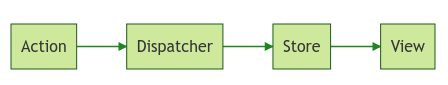

# VSCode Plugin｜Markdown Preview Enhanced

Markdown Preview Enhanced ported to vscode

## Installation

Marketplace: https://marketplace.visualstudio.com/items?itemName=shd101wyy.markdown-preview-enhanced

- VSCode: `Ctrl + P`
    ```bash
    ext install shd101wyy.markdown-preview-enhanced
    ```

***

## Usage

Shortcuts            | Functionality
:--                  | :--
`Ctrl + K => V`      | Open preview to the Side
`Ctrl + Shift + V`   | Open preview
`Ctrl+ Shift + S`    | Sync preview / Sync source
`Shift + Enter`      | Run Code Chunk
`Ctrl + Shift Enter` | Run all Code Chunks

### Markdown Preview Enhanced のテーマカスタマイズ
- デフォルトのテーマは`github-light.css`
- `Ctrl + Shift + P` => `Markdown Preview Enhanced: Customize Css`を開く
    ```css
    .markdown-preview.markdown-preview {
        /* modify your style here */
    }
    ```

---

### Mermaid記法
~~~markdown
    ```mermaid
    graph LR
        A[Action] --> B[Dispatcher]
        B --> C[Store]
        C --> D[View]
    ```
~~~


#### 図表が黒くなる場合
MPEのバグなのか、Mermaid記法で書いたチャートの図表が黒くなる場合がある

そのような場合は、一度スタイルを変更すると直る

- VSCode: `Ctrl + ,` => 設定を開く
    - 設定 > 拡張機能 > Markdown Preview Enhanced
        - Mermaid Theme: `forest`などに変更する
- 一度プレビューを確認してみると、スタイルが`forest`テーマなどに変更されている
- `Ctrl + ,` > 拡張機能 > Markdown Preview Enhanced
    - Mermaid Theme: `default`に戻す
- プレビューを確認すると、図表が黒くなっている現象が直っているはず
