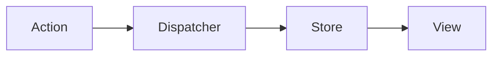
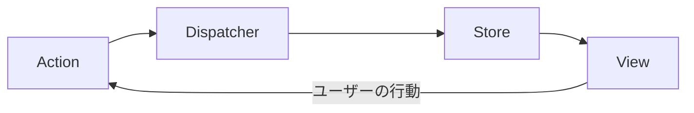
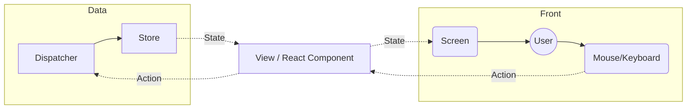
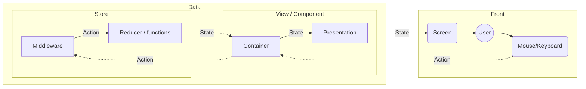

```mermaid
graph LR
    A[Action] --> B[Dispatcher]
    B --> C[Store]
    C --> D[View]
```

```mermaid
graph LR
    A[Action] --> B[Dispatcher]
    B --> C[Store]
    C --> D[View]
    D --> |ユーザーの行動|A
```

```mermaid
graph LR
    Dispatcher[Dispatcher]
    Store[Store]
    View[View / React Component]
    Screen(Screen)
    User((User))
    Device(Mouse/Keyboard)

    subgraph Data
        Dispatcher --> Store
    end

    Store -.-> |State|View
    View -.-> |State|Screen
    
    subgraph Front
        User --> Device
        Screen --> User
    end

    Device -.-> |Action|View
    View -.-> |Action|Dispatcher
```

```mermaid
graph LR
    Middleware[Middleware]
    Reducer[Reducer / functions]
    Container[Container]
    Presentation[Presentation]
    Screen(Screen)
    User((User))
    Device(Mouse/Keyboard)

    subgraph Front
        User --> Device
        Screen --> User
    end

    subgraph Data
        subgraph Store
            Middleware --> |Action|Reducer
        end

        subgraph View / Component
            Container --> |State|Presentation
        end

        Reducer -.-> |State|Container
        Container -.-> |Action|Middleware
    end

    Presentation -.-> |State|Screen
    Device -.-> |Action|Container
```
